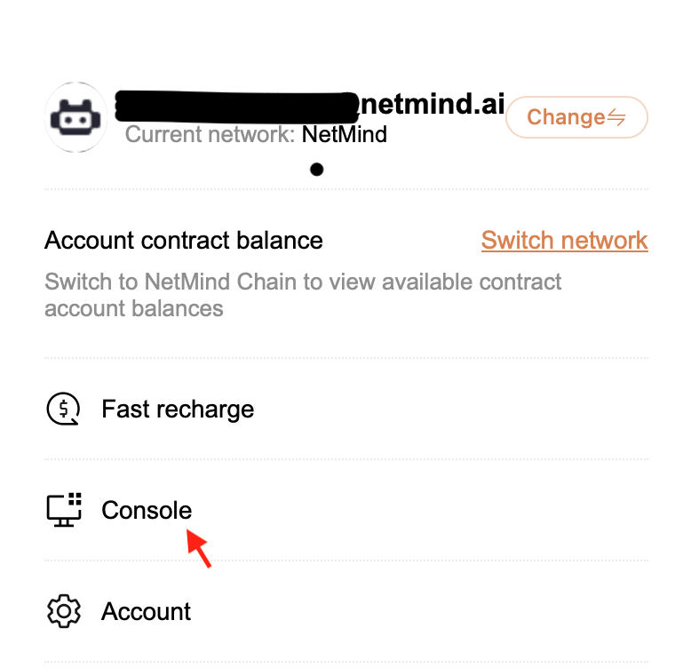
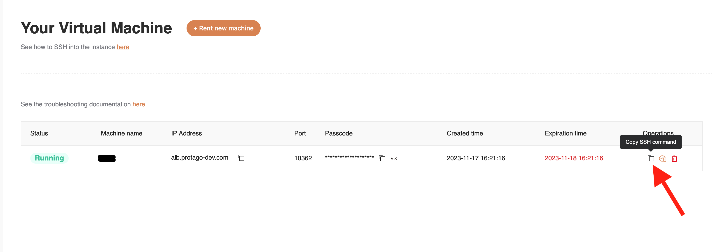
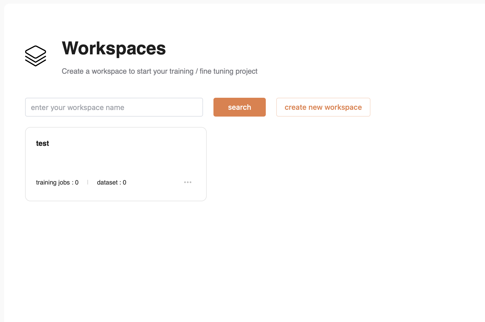
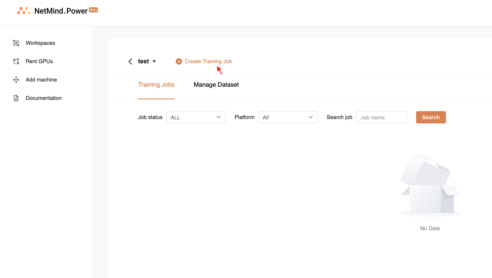
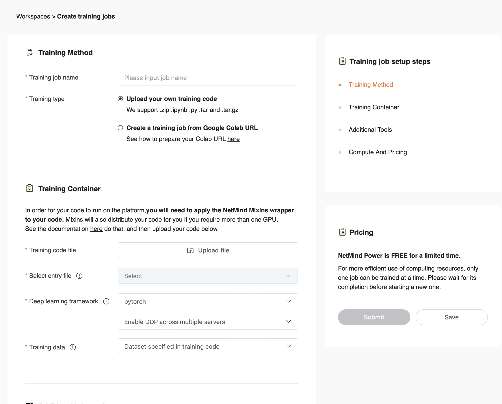
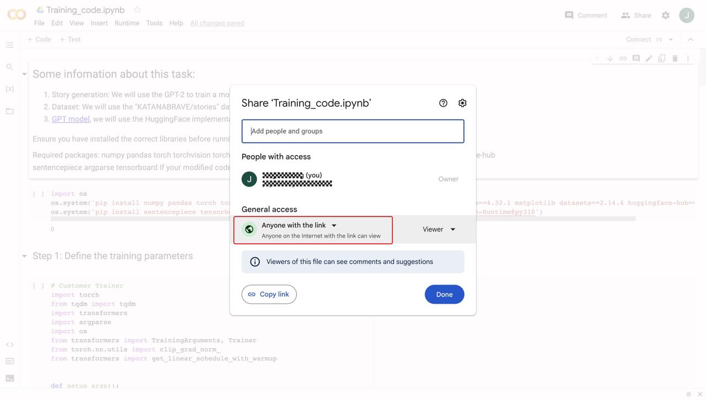
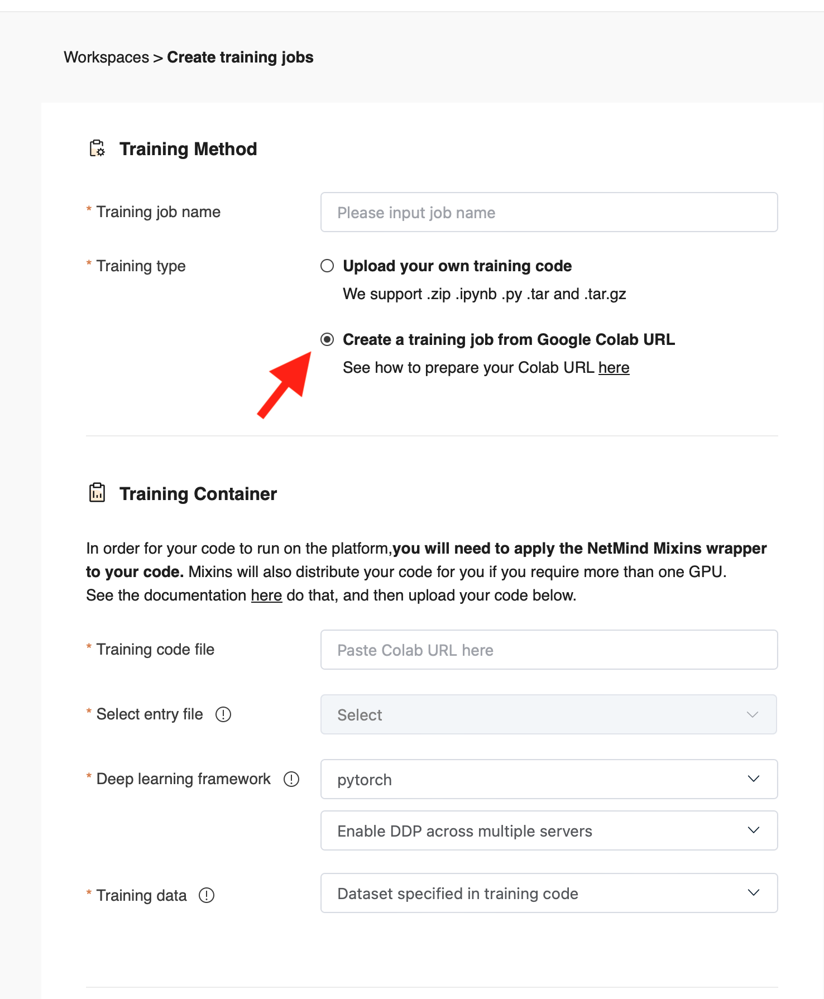
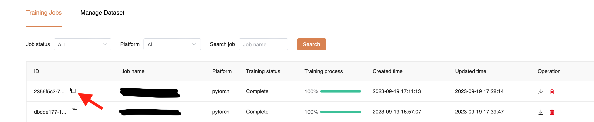
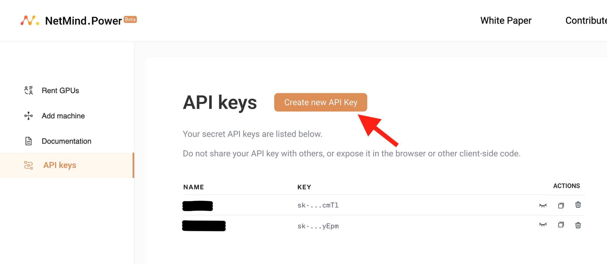

# Documentation - Table of Contents
- [Documentation - Table of Contents](#documentation---table-of-contents)
- [Sign Up Process](#sign-up-process)
- [Getting Started with SSH](#getting-started-with-ssh)
- [Getting Started with the Power Platform](#getting-started-with-the-power-platform)
- [Add `NetmindMixins` to your Training Code](#add-netmindmixins-to-your-training-code)
  - [Example 1: Implementing your own Training Loop with PyTorch](#example-1-implementing-your-own-training-loop-with-pytorch)
    - [Uploading Datasets](#uploading-datasets)
    - [Initialization](#initialization)
    - [Model and Optimizer Instantiation](#model-and-optimizer-instantiation)
    - [Training](#training)
  - [Example 2: Using HuggingFace `Trainer` Class](#example-2-using-huggingface-trainer-class)
    - [Uploading Datasets and Setting Training Arguments](#uploading-datasets-and-setting-training-arguments)
    - [Initialization](#initialization-1)
    - [Training](#training-1)
- [Import a Training Job from Google Colab](#import-a-training-job-from-google-colab)
- [Export Trained Models' Checkpoints to Google Colab or any other Machine for Inference](#export-trained-models-checkpoints-to-google-colab-or-any-other-machine-for-inference)

# Sign Up Process

In order to use any NetMind service, you need to [create an account](https://power.netmind.ai/sign/login) first. You can register with your Google or Microsoft account, or with any email address. After login, click on the icon on the top right of the screen and select "Console" from the dropdown menu (see image below).   
<p align="center">

</p>

You will be directed to your personal page.

# Getting Started with SSH

Follow these steps to rent a server with GPUs.
After signing in, select "Console" from the dropdown menu. You will be directed to your personal page. Select "Rent GPU" from the dropdown on the left, and then click on "Rent new machine".  
Fill in the form which will appear. At the end you will be asked to choose a password which you will use to SSH. Click "Rent machine" once the form is complete.
You should now see a dashboard with your newly rented machine. If you do not see the IP Address and Port, you may need to manually refresh the browser page. You can copy the SSH command by clicking on the button as shown below.
<p align="center">

</p>
The command will look like this   

```bash
ssh root@alb.protago-dev.com -p 10362
```

If you're on Linux os MacOS, you will usually be able to pass this command directly to your terminal in order to connect. For Windows users, you can SSH using the PuTTY software from [this link](https://www.putty.org).   
Our product also supports IDE connection (for example via VSCode).

NOTES
- If any failure or technical issue is detected on the server, the machine status on the dashboard might be shown as "Offline". In that case a "re-start" button should appear, please restart the machine. If the problem persists, contact our support at [hello@netmind.ai](mailto:hello@netmind.ai).
- When you request a machine, you will be able to specify a set rental time up to 7 days. We will send you a reminder you to renew the lease when you have less than one day remaining. If you do not renew, the lease will expire and all data will be permanently removed from the server.
- It is not possible to retrieve data after the rental is terminated and the machine has been released back to our pool of available servers. We suggest you keep a local backup of any relevant data before terminating the rental. If you're on a Linux or MacOS system, this could be achieved via Secure Copy with the `scp` command. The example below shows how to donwnload the `/data/example.zip` folder from the remove machine to your local machine in the home directory, when run form your local machine. You will need to adjust the poet and address name accordingly
```bash
scp -P 10362 root@alb.protago-dev.com:/data/example.zip ~/example.zip
```
On Windows, you can use [WinSCP](https://winscp.net/eng/index.php).


# Getting Started with the Power Platform

After signing in, select "Console" from the dropdown menu. You will be directed to your personal page. Select "Workspaces" from the dropdown on the left, and then select "create a new workspace", assign your workspace a name and press "Confirm". A workspace should now appear under your Workspaces. For example, a workspace named "test" will look like this. 
<p align="center">

</p>
Click on your workspace box and then click on "Create Training job", as shown below.
<p align="center">

</p>
You should then see the following page.  
<p align="center">

</p>

Assign your training job a name and fill in the fields as required. You will need to upload your training code and data, if applicable. In order for your code to train successfully on our platform, you need to make some minor modifications to your codebase by adding the `NetmindMixins` library. The required modifications depend on whether you're implementing a custom training loop or using HuggingFace `Trainer` class. Details are given in the [section below](#add-netmindmixins-to-your-training-code).  

We also support uploading a training job directly from Google Colab. For a step-by-step guide, see the section [Import a Training Job from Google Colab](#import-a-training-job-from-google-colab) at the end.

# Add `NetmindMixins` to your Training Code

Here we share some examples and general guidance for how to train machine learning models on our platform using the `NetmindMixins` library. `NetmindMixins` is a proprietary library developed by NetMind.AI in order to facilitate training of machine learning models across our distributed platform ecosystem, the NetMind Power platform. It is already pre-installed into all our environments, so you need not worry about installation. Please specify any other required library for your project in a `requirements.txt` file and add it to the root folder of your project structure. This will ensure any listed library is installed before running your code. If the file has a different name, it will not be recognized by our system. 
Below are the instructions and general principles to follow in order to add our `NetmindMixins` framework to your existing training code. This is necessary in order to successfully run your code on our platform, as it allows us to monitor essential functions such as training progress, to estimate training time, to save checkpoint on cloud and bill accounts appropriately, and to distribute the workload across multiple machines. While detailed general instructions are shown below, if you want to see some specific examples of how they are implemented in practice, please see the following example files (available in this repository) and notebooks (links below).

**Files**

1. `story_custom_trainer.py`: in this file, we show how to apply our `NetmindMixins` wrapper to a custom training function.
2. `story_hf_trainer_data_parallel.py`:  in this file we use the `transformers`'s `Trainer` to do the training and use our `NetmindMixins` wrapper to implement data parallelism.
3. `story_hf_trainer_model_parallel.py`: in this file we use the `transformers`'s `Trainer` to do the training and use our `NetmindMixins` wrapper to implement model parallelism.

**Notebooks**

| Type |           Python File Name           | Colab |
|:---:|:------------------------------------:|:---:|
|Custom Trainer|      `story_custom_trainer.py`       |[](https://colab.research.google.com/drive/1r1WTCnvZ81du3b9WJy-1AkmFAtUOFm6J?usp=sharing) |
|HuggingFace Trainer|        `story_hf_trainer.py`         |[](https://colab.research.google.com/drive/1rf-0AcbQTbrb0cIp0EKzjFIeKvxXx6hh?usp=sharing) |
|Model Parallel| `story_hf_trainer_model_parallel.py` |[](https://colab.research.google.com/drive/1VZFUlzIqd7lboJ1kGbTc3zqmo0zBB5pe?usp=sharing) |\


NOTE: If you convert a Google Colab notebook to a python file, remember to remove library install lines such as

> `!pip install ...`  
> `!git clone ...`

and anything else which is not valid python code.


The instructions given below vary based on whether you are implementing a custom training loop using the PyTorch framework, or using HuggingFace `Trainer` class.

The two examples should be generalizable and adaptable to the vast majority of use cases. However, if you feel they do not apply or cannot be applied to your codebase, feel free to join our [Discord support channel](https://discord.com/channels/1050399764941906031/1050399765441040456) or reach out at [hello@netmind.ai](mailto:hello@netmind.ai) and a member of our team will aim to provide more tailored guidance.


## Example 1: Implementing your own Training Loop with PyTorch

### Uploading Datasets

In the UI, you will be asked to upload your code and your dataset separately. The dataset upload supports a much larger size limit than the code upload. Both your code and dataset folders should be uploaded as zip files, unless the code consists of a single python file, in which case it can be uploaded directly. If your project has a multi-folder structure, we ask that the "entry file" (the script being run when training your model) be placed into the root folder of the project. This file can then import modules located in other folders as well of course.  
In order to access the dataset from your python file, you should define a `data` training argument in your entry file; your data folder can then be accessed via `training_args.data`. See example below

```python
import argparse

def setup_args():
    parser = argparse.ArgumentParser()
    parser.add_argument(
        '--data', type=str, required=False, help=''
    )
    return parser.parse_known_args()[0]

training_args = setup_args()
```

The Power platform will then automatically pass the data argument to your code, which can be accessed through `training_args.data`. Below are two examples showing how you can load your data via `training_args.data` (each codebase will vary so you will need to tailor this to your code.)

1. If the folder you uploaded has a structure that can be loaded using HuggingFace datasets library, you can load it in this way
```python
from datasets import load_dataset
data = load_dataset(training_args.data)
```
2. If your uploaded data folder contains files within subfolder which you need to access, for example you need to load the `data/SQuAD/train-v1.1.json` file, you can do it in this way
```python
with open(os.path.join(training_args.data, "SQuAD/train-v1.1.json"), "r") as f:
    train = json.load(f)
```

### Initialization

These are the required import statements

```python
from NetmindMixins.Netmind import nmp, NetmindOptimizer, NetmindDistributedModel
```
and the library is initialized as follows

```python
nmp.init(use_ddp=True)
```
This initialization line should be placed in your code before the training loop.  
NOTE: please do not call `torch.distributed.init_process_group` after `nmp.init`, as it's already called within `nmp.init` and doing this twice will raise an error.  
Set `use_ddp=True` to use data parallelism and `use_ddp=False` to use model parallelism.
At the moment, we support model parallelism or data parallelism, but we do not support both at the same time. We leave it to the users, as the experts in their models, to make the best decision as to which technique to use, however if in doubt, we recommend starting with data parallelism and if you encounter a memory error (for example your model cannot fit within the GPU RAM even when using low batch sizes), then switch to model parallelism.

If you intend to run the model using data parallelism with `use_ddp=True` as shown above, you also need to set the model, and any relevant tensor (such as input ids) to device number zero, as shown below
```python
import torch

device = torch.device("cuda:0")
model.to(device)
```
We will take care of distributing your training across multiple devices. This step does not apply if you are using model parallelism.


### Model and Optimizer Instantiation

After you have instantiated your machine learning model and optimizer in the usual way (which will depend on the specifics of your codebase), you should wrap both the model and the optimizer around our model and optimizer classes as shown below.
1. If you are using distributed data parallelism
```python
ddp_model = NetmindDistributedModel(
    torch.nn.parallel.DistributedDataParallel(model)
)
optimizer = NetmindOptimizer(optimizer)
```
2. If you are not using distributed data parallelism (for example you're using distributed model parallelism instead, or no parallelism)
```python
ddp_model = NetmindDistributedModel(model)
optimizer = NetmindOptimizer(optimizer)
```

### Training

Before you run the training loop, you should make this inplace training bar initialization
```python
nmp.init_train_bar(max_steps=1000)
```
where `max_steps` allows you to control the number of total training steps your model will be run for. If you do not want to set a maximum number of steps, we suggest setting this parameter to a very large number, larger than the length of your training dataset multiplied by the number of training epochs, so this number will never be reached, regardless of the batch size chosen.

Inside the training loop you will need to make a call to `nmp.step`, which is required to allow us to monitor the training progress. Without this, we cannot estimate the total training time and also cannot allow you to monitor metrics such as the loss via our user interface. Where exactly you place this call will depend on your code structure, but in general it should be placed at the end of each training step, after you have calculated the loss. If you have a standard structure with two `for` loops, one for each epoch and one for each training step respectively, your code should look like this
```python
for epoch in range(training_args.num_train_epochs):
    ...  # YOUR CODE
    model.train()
    total_loss = 0
    for train_step, batch in enumerate(train_data):
        optimizer.zero_grad()
        ...  # YOUR CODE, INCLUDING THE FORWARD PASS
        optimizer.step()
        scheduler.step()  # You may or may not have a scheduler

        # REQUIRED ADDITION BELOW
        monitor_metrics = {
            "loss": loss.item(),
            "Learning rate": scheduler.get_last_lr()[0]  # remove if you don't have a scheduler
        }
        nmp.step(monitor_metrics)
```
WARNING: If you have both a training and an evaluation loop in your code, please make sure `nmp.step` is added to the training loop. You can also use `nmp.evaluate` outside the evaluation loop (if you have one) as shown below.  
NOTE: while `nmp.step` needs to be placed **inside** the training loop, at the end of the innermost loop after each training step, `nmp.evaluate` needs to be placed **outside** the evaluation loop at the end. Adding `nmp.evaluate` is optional, but will help us to calculate the evaluation metrics and update the UI.
```python
for train_step, batch in enumerate(valid_data):
    ...  # YOUR CODE, INCLUDING THE FORWARD PASS

training_stats[f"epoch_{epoch + 1}"] = {
    "training_loss": average_training_loss_per_batch,
    "valid_loss": average_validation_loss_per_batch,
    "valid_accuracy": average_validation_accuracy_per_epoch,
    "training_time": training_time,
    "valid_time": valid_time
}
nmp.evaluate(training_stats[f"epoch_{epoch + 1}"])
```
NOTE: The variables shown above, such as `average_training_loss_per_batch` are for illustration purposes, and you should adapt them based on your code.

At the very end of the training code (after all epochs have finished, outside all training loops), you must call this inplace function once:

```python
nmp.finish_training()
```

Your trained model checkpoints will then become available for you to download from the NetMind Power platform UI once the training is complete.

## Example 2: Using HuggingFace `Trainer` Class

### Uploading Datasets and Setting Training Arguments
In the UI, you will be asked to upload your code and your dataset separately. The dataset upload supports a much larger size limit than the code upload. Both your code and dataset folders should be uploaded as zip files, unless the code consists of a single python file, in which case it can be uploaded directly. If your project has a multi-folder structure, we ask that the "entry file" (the script being run when training your model) be placed into the root folder of the project. This file can then import modules located in other folders as well of course.  
In your code you will need to define a `ModelTrainingArguments` class which inherits from HuggingFace `transformers.TrainingArguments` class, as shown below.
```python
from transformers import TrainingArguments, HfArgumentParser

@dataclass
class ModelTrainingArguments(TrainingArguments):
    data: str = None
    max_steps: int = 1000
    ...

parser = HfArgumentParser(ModelTrainingArguments)
training_args = parser.parse_args_into_dataclasses(return_remaining_strings=True)[0]
```
This class sets the training arguments to be passed to the `Trainer`. As shown above, you should set `data` to `None`, and `max_steps` as required, which allows you to control the number of total training steps your model will be run for. If you do not want to set a maximum number of steps, we suggest setting this parameter to a very large number, larger than the length of your training dataset multiplied by the number of training epochs, so this number will never be reached, regardless of the batch size chosen. Any other training argument you wish to pass to the `Trainer` class should be set within the `ModelTrainingArguments` class above.

If you uploaded a dataset, you can access it from your code through `training_args.data`. Below are two examples showing how you can load your data via `training_args.data` (each codebase will vary so you will need to tailor this to your code.)

1. If the folder you uploaded has a structure that can be loaded using HuggingFace datasets library, you can load it in this way
```python
from datasets import load_dataset
data = load_dataset(training_args.data)
```
2. If your uploaded data folder contains files within subfolder which you need to access, for example you need to load the `data/SQuAD/train-v1.1.json` file, you can do it in this way
```python
with open(os.path.join(training_args.data, "SQuAD/train-v1.1.json"), "r") as f:
    train = json.load(f)
```

### Initialization

These are the required import statements

```python
from NetmindMixins.Netmind import nmp, NetmindTrainerCallback
```
and the library is initialized as follows

```python
nmp.init(use_ddp=True)
```
This initialization line should be placed in your code before instantiating the HuggingFace `Trainer` class (see below).  
NOTE: please do not call `torch.distributed.init_process_group` after `nmp.init`, as it's already called within `nmp.init` and doing this twice will raise an error.
Set `use_ddp=True` to use data parallelism and `use_ddp=False` to use model parallelism.
At the moment, we support model parallelism or data parallelism, but we do not support both at the same time. We leave it to the users, as the experts in their models, to make the best decision as to which technique to use, however if in doubt, we recommend starting with data parallelism and if you encounter a memory error (for example your model cannot fit within the GPU RAM even when using low batch sizes), then switch to model parallelism.

If you need to implement your own training and / or evaluation metrics, you should create a class inheriting from `NetmindTrainerCallback` and adapt it to your use case, as shown in the example below.

```python
import transformers

class CustomTrainerCallback(NetmindTrainerCallback):
    def __init__(self):
        super().__init__()

    '''
    Add custom training metrics
    '''

    def on_step_end(
        self, args: transformers.TrainingArguments, 
        state: transformers.TrainerState,
        control: transformers.TrainerControl, **kwargs
    ):
        kwargs["custom_metrics"] = {}
        return super().on_step_end(args, state, control, **kwargs)

    '''
    Add custom evaluation metrics
    '''

    def on_evaluate(
        self, args: transformers.TrainingArguments, 
        state: transformers.TrainerState,
        control: transformers.TrainerControl, **kwargs
    ):
        kwargs["custom_metrics"] = {}
        return super().on_evaluate(args, state, control, **kwargs)
```
If you do not need to add any custom metrics on training or evaluation, you can skip the step above and use `NetmindTrainerCallback` directly when instantiating the `Trainer` (see explanation below).

### Training

When implementing the HuggingFace `Trainer`, you will need to set `args=training_args` (see above for how `training_args` was defined) and add the `callbacks=[CustomTrainerCallback]` as an argument of your `Trainer` class as shown below. If you didn't define a `CustomTrainerCallback` class, then you can set this argument to `callbacks=[NetmindTrainerCallback]`. After the training is done, you also need to call `nmp.finish_training` inplace. See the example below
```python
from transformers import Trainer


trainer = Trainer(
    model=...,
    tokenizer=...,
    args=training_args,
    train_dataset=...,
    eval_dataset=...,
    optimizers=...,
    ...,
    callbacks=[CustomTrainerCallback]
)
trainer.remove_callback(transformers.trainer_callback.PrinterCallback)
trainer.remove_callback(transformers.trainer_callback.ProgressCallback)

trainer.train()

nmp.finish_training()
```

Your trained model checkpoints will then become available for you to download from the NetMind Power platform UI once the training is complete.


# Import a Training Job from Google Colab

We now also allow you to import a training job directly from Google Colab to the Netmind Power platform. You can do this by following these steps:
1) Find your training code file on Google Colab
2) Modify your code by adding the `NetMindMixins` library as explained in [this section](#add-netmindmixins-to-your-training-code).
3) Share your Google Colab file with NetMind Power. In order to do this, you will need to make your code visible to "Anyone with the link" (see below)
<p align="center">

</p>  
NOTE: We are working on a more private solution, which will only ask you to share your training code with our company official account. If you do not wish to do this, you can always upload your training code directly to the platform.  

4) Follow the same steps as in the [Getting Started](#getting-started) section in order to create a new training job. However, when you get to the final interface, under "Training type" you should select "Using Google Colab URL" as shown below.
<p align="center">

</p>   

5) Under "Training file", simply paste the URL link provided by Google Colab for your notebook
6) Fill the rest of the fields as required and submit the training job.

NOTE: 
If you choose to upload your own data locally, you should follow the instructions in the [Uploading Datasets](#uploading-datasets) section and access the data from your code via `training_args.data`.


# Export Trained Models' Checkpoints to Google Colab or any other Machine for Inference

After you have trained your model using our Power Platform, if you wish to do inference, you can download your checkpoints on Google Colab, your local machine or any machine with an internet connection. In order to do that please follow the steps below.
1) On your Workspace, copy the ID of the training job you want to download the checkpoints for. You can do it by clicking on the squared icon below. An example ID would be `2356f5c2-7f25-436f-a4b2-759e9e12a01b`. <p align="center"></p>
2) On your Console, use the left panel to navigate to the "API keys" tab and then click on "Create new API Key". On the field "Name" assign a unique name to your key and click "Create secret key" when done. An API key will then be generated, for example `INIYBEXPK68U1CLH`. <p align="center"></p>
3) Open the environment you want to download the checkpoints to. This could be Google Colab, your local machine or any machine with an internet connection. Run the script below and replace your job ID and API key accordingly. Note that this script will install NetmindMixins in your python environment.
```python
import os
os.system("pip install git+https://github.com/protagolabs/NetMind-Mixin-Runtime@py310")
from NetmindMixins.Netmind import nmp

model_path = nmp.download_checkpoint(
    job_id="2356f5c2-7f25-436f-a4b2-759e9e12a01b",  # replace with your job ID
    token="INIYBEXPK68U1CLH"  # replace with your API key
)
if not model_path:
    raise Exception("download failed")
print(f"Checkpoints successfully downloaded at: {model_path}")
```
