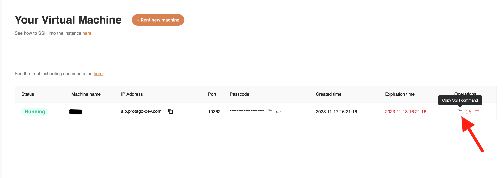

# Getting Started with SSH

Follow these steps to rent a server with GPUs. After signing in, select "Console" from the dropdown menu. You will be directed to your personal page. Select "Rent GPU" from the dropdown on the left, and then click on "Rent new machine".\
Fill in the form which will appear. At the end you will be asked to choose a password which you will use to SSH. Click "Rent machine" once the form is complete. You should now see a dashboard with your newly rented machine. If you do not see the IP Address and Port, you may need to manually refresh the browser page. You can copy the SSH command by clicking on the button as shown below.

<div align="center">



</div>

The command will look like this

```bash
ssh root@alb.protago-dev.com -p 10362
```

If you're on Linux os MacOS, you will usually be able to pass this command directly to your terminal in order to connect. For Windows users, you can SSH using the PuTTY software from [this link](https://www.putty.org).\
Our product also supports IDE connection (for example via VSCode).

NOTES

* If any failure or technical issue is detected on the server, the machine status on the dashboard might be showing as "Offline". In that case a "restart" button should appear, please restart the machine. If the problem persists, contact our support at [hello@netmind.ai](mailto:hello@netmind.ai).
* When you request a machine, you will be able to specify a set rental time up to 7 days. We will send you a reminder to renew the lease when you have less than one day remaining. If you do not renew, upon expiry the machine will be made available for anyone to rent and all your data will be permanently and securely removed from the server.
* It is not possible to retrieve data after the rental is terminated and the machine has been released back to our pool of available servers. We suggest you create a local backup of any relevant data before terminating the rental. If you're on a Linux or MacOS system, this could be achieved via Secure Copy with the `scp` command. The example below shows how to donwnload the `/data/example.zip` folder from the remote machine to your local machine in the home directory, when run form your local machine. You will need to adjust the port and IP address accordingly. On Windows, you can use [WinSCP](https://winscp.net/eng/index.php).

```bash
scp -P 10362 root@alb.protago-dev.com:/data/example.zip ~/example.zip
```

##
